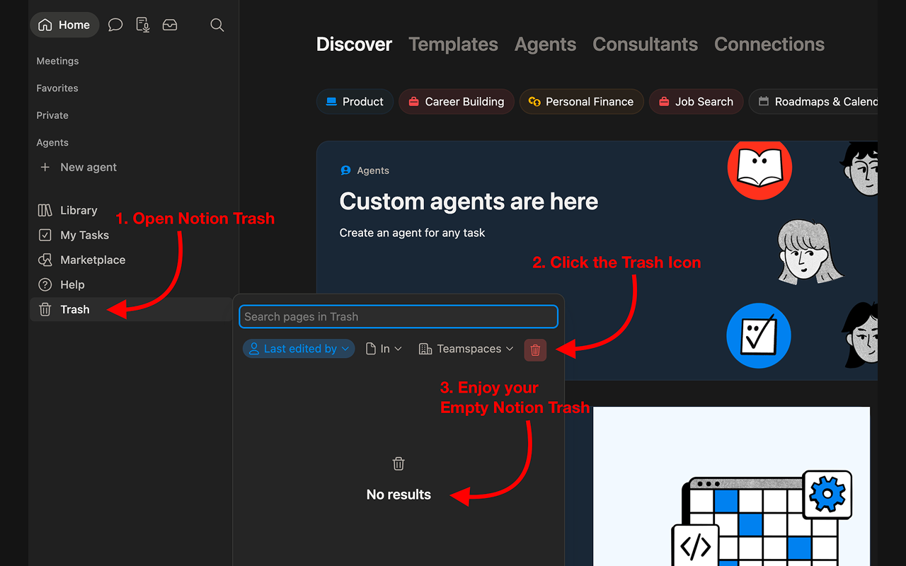

# Notion Trash Cleaner

A Chrome extension that permanently deletes all pages in your Notion trash with a single click — no manual scrolling, no "Delete all" button that Notion doesn't provide.


---

## Features

- Injects an **"Empty trash"** button directly into Notion's trash filter bar
- Handles **any number of trashed items** (paginated, not capped at 1000)
- Shows a live deletion counter while working
- Confirmation dialog before any destructive action
- Matches Notion's native UI style (dark/light mode aware via CSS variables)

## Screenshot



## Installation

The extension is not yet on the Chrome Web Store. Load it manually:

1. Clone or download this repository
   ```
   git clone https://github.com/marcofugaro/Notion-Trash-Cleaner.git
   ```
2. Open Chrome and navigate to `chrome://extensions`
3. Enable **Developer mode** (top-right toggle)
4. Click **Load unpacked** and select the `Notion-Trash-Cleaner` folder

## Usage

1. Open [app.notion.com](https://app.notion.com) in Chrome
2. Open the **Trash** panel from the left sidebar
3. Click the red **Empty trash** button that appears in the filter bar
4. Confirm the deletion in the dialog — done

## How it works

The extension injects a content script on `app.notion.com`. When the Trash panel opens, a MutationObserver detects it and appends the button into the filter row. On click, it calls Notion's internal API (`/api/v3/search` + `/api/v3/deleteBlocks`) using your existing browser session cookies — no API key or OAuth needed.

## Limitations

- Works on **app.notion.com only** (not the desktop app)
- Only top-level pages are targeted; child blocks are deleted by cascade when their parent is removed
- Pages in shared workspaces where you don't have edit permissions are skipped silently
- If you navigate away during deletion, the operation continues in the background and a toast appears when done
- Uses Notion's undocumented internal API — may break if Notion changes it

## Privacy

The extension makes requests only to `app.notion.com` using your existing logged-in session. No data is sent anywhere else.

## License

[MIT](LICENSE)
